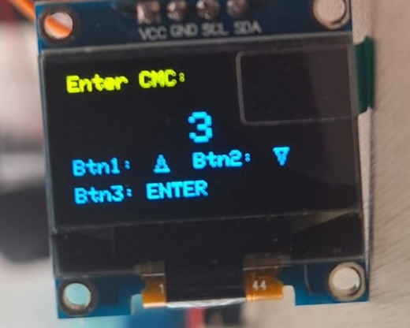
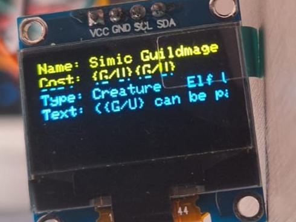

# Magic the Gathering Momir Game with Raspberry Pi Pico W

## Project Description

This project is a **Momir** game based on Magic: The Gathering. It uses the **Scryfall API** to generate random cards for the game. The project runs on a Raspberry Pi Pico W using **CircuitPython** and displays the card information on an OLED display. Additionally, the card details are printed on a **thermal printer** for a physical copy.

## Circuit Schematic
The circuit schematic is located inside the `img/` folder. Here are the GPIO pin assignments for this project:

- **GPIO 8**: Button for "Enter" to confirm a selection.
- **GPIO 7**: Button for "Down" navigation.
- **GPIO 6**: Button for "Up" navigation.
- **GPIO 5**: TX communication with an thermal printer.
- **GPIO 4**: RX communication with an thermal printer.
- **GPIO 1**: SCL communication with an Oled Display.
- **GPIO 0**: SCA communication with an Oled Display.

Please refer to the schematic image `img/schematic.png` for the full wiring diagram.

### Schematic Diagrams:

## Display and Printer Images
The OLED display will show information about the game state, such as the connected Wi-Fi and the generated card details. The generated card details will also be printed on a thermal printer. Here are some example display outputs from the project:

### OLED Display Example:

### Thermal Printer Output Example:

## Libraries Used

This project uses several libraries available in the `raspberryPicoW/all_files/` directory:

- **Adafruit CircuitPython SSD1306**: Used for controlling the OLED display.
- **Adafruit CircuitPython requests**: Used for API calls to Scryfall.
- **Adafruit CircuitPython wifi**: Used for connecting to Wi-Fi.
- **Adafruit CircuitPython button**: Used for handling button inputs.
- **Adafruit CircuitPython thermal printer**: Used to print the card information on the thermal printer.

Make sure all the necessary libraries are placed in the `raspberryPicoW/all_files/` folder for the project to run successfully.

## Installation and Setup

1. Install the necessary libraries by copying them to the `lib/` folder on your Raspberry Pi Pico W.
2. Modify the `wifi_secret.py` file with your Wi-Fi credentials (SSID and password).
3. Upload the code files (`code.py` and `wifi_secret.py`) to the root of your Raspberry Pi Pico W.
4. Power up the Raspberry Pi Pico W, and it will automatically run the code.

## Running the Project

Once powered up, the Raspberry Pi Pico W will:

1. Connect to the Wi-Fi using the credentials from the `wifi_secret.py` file.
2. Display the connection status on the OLED screen.
3. Start the Momir game by generating random Magic: The Gathering cards using the Scryfall API.
4. Allow navigation using the buttons connected to GPIO pins.
5. Print the generated card details on the thermal printer.

## License
This project is open-source and available under the MIT License. See the LICENSE file for more information.

---

Feel free to explore the code

