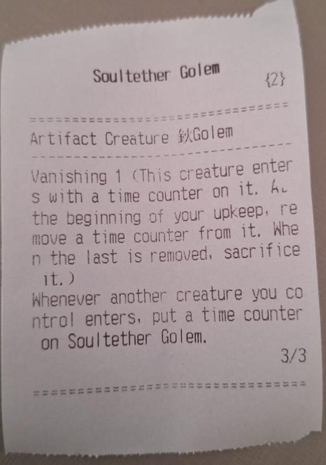

# Magic the Gathering Momir Game with Raspberry Pi Pico W

## Project Description

This project is a **Momir** game based on Magic: The Gathering. It uses the **Scryfall API** (https://scryfall.com/docs/api) to generate random cards for the game. The project runs on a Raspberry Pi Pico W using **CircuitPython** and displays the card information on an OLED display. Additionally, the card details are printed on a **thermal printer** for a physical copy.

### Components
These are the components used in this project, along with links to where I purchased them. Note that I don’t receive any commission or sponsorship from these vendors.

- **OLED Display SSD1306**: A 0.96" I2C OLED display for displaying card information. [View on MakerHero](https://www.makerhero.com/produto/display-oled-0-96-i2c-azul-amarelo/)
- **Thermal Printer QR204**: Used to print card details for Magic: The Gathering gameplay. [View on Amazon](https://www.amazon.com.br/Impressora-Embutidos-Interface-Impressão-Velocidade/dp/B09SLRYVLX?dib=eyJ2IjoiMSJ9.v9BuBsMk-0-AU80VuPvVn1eoEbpjG6LP8RDwXBchbr3NeuiZkpJWYj_lmojVrWmkfNVzwoE22miVnqXa2Am-A0-LzW932i98gh0SnY_r24U.Ka7JJ24gz-jwe431e5LSB-87YlXlQs8-xkN9nf6Wmmo&dib_tag=se&keywords=qr204&qid=1731605326&sr=8-1&ufe=app_do%3Aamzn1.fos.4bb5663b-6f7d-4772-84fa-7c7f565ec65b&th=1)
- **Raspberry Pi Pico W**: A Wi-Fi enabled microcontroller running CircuitPython, which serves as the brain of this project. [View on MakerHero](https://www.makerhero.com/produto/raspberry-pi-pico-w/)

## Circuit Schematic
The circuit schematic is located inside the `img/schematic.png` folder. Here are the GPIO pin assignments for this project:

- **GPIO 8**: Button for "Enter" to confirm a selection.
- **GPIO 7**: Button for "Down" navigation.
- **GPIO 6**: Button for "Up" navigation.
- **GPIO 5**: TX communication with an thermal printer.
- **GPIO 4**: RX communication with an thermal printer.
- **GPIO 1**: SCL communication with an Oled Display.
- **GPIO 0**: SCA communication with an Oled Display.

### Schematic Diagrams:

## Display and Printer Images
The OLED display will show information about the game state, such as the connected Wi-Fi and the generated card details. The generated card details will also be printed on a thermal printer. Here are some example display outputs from the project:

### OLED Display Example:

### Thermal Printer Output Example:

## Libraries Used

This project uses several libraries available in the `raspberryPicoW/all_files/` directory:

- **Adafruit CircuitPython SSD1306**: Used for controlling the OLED display.
- **Adafruit CircuitPython requests**: Used for API calls to Scryfall.
- **Adafruit CircuitPython wifi**: Used for connecting to Wi-Fi.
- **Adafruit CircuitPython button**: Used for handling button inputs.
- **Adafruit CircuitPython thermal printer**: Used to print the card information on the thermal printer.

Make sure all the necessary libraries are placed in the `raspberryPicoW/all_files/` folder for the project to run successfully.

## Installation and Setup

1. Install the necessary libraries by copying them to the `lib/` folder on your Raspberry Pi Pico W.
2. Modify the `wifi_secret.py` file with your Wi-Fi credentials (SSID and password).
3. Upload the code files (`code.py` and `wifi_secret.py`) to the root of your Raspberry Pi Pico W.
4. Power up the Raspberry Pi Pico W, and it will automatically run the code.

## Running the Project

Once powered up, the Raspberry Pi Pico W will:

1. Connect to the Wi-Fi using the credentials from the `wifi_secret.py` file.
2. Display the connection status on the OLED screen.
3. Start the Momir game by generating random Magic: The Gathering cards using the Scryfall API.
4. Allow navigation using the buttons connected to GPIO pins.
5. Print the generated card details on the thermal printer.

## License
This project is open-source and available under the MIT License. See the LICENSE file for more information.

---

Feel free to explore the code

---
### FAQ

#### Q: Why don't you print the card image?
**A:** Unfortunately, when I try to send the card image as a bitmap to the thermal printer, it ends up printing a series of random characters, which results in unreadable output. Currently, the system only prints the card information in text format.

#### Q: Can you make this for an Arduino?
**A:** I intend to create a version of this project for the ESP32. Once that's done, it should be possible to modify the code to work with an Arduino. Stay tuned for future updates!
